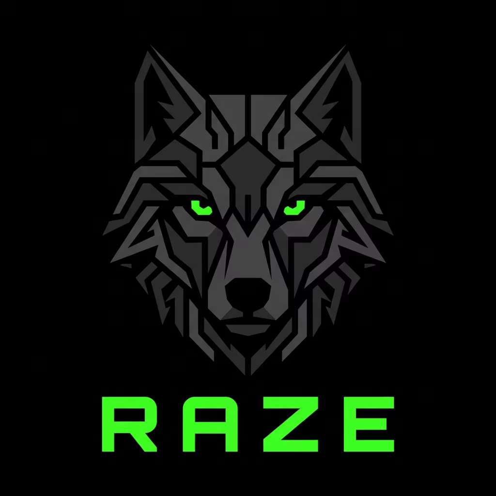

<p align="center">
  
</p>

# raze

Raze is an open-source, AI-orchestrated smart contract security tool for Foundry projects.

It is built for developers who want to explore, validate, and prove smart contract security issues with their existing AI, without giving up deterministic execution.

Raze does not ship its own LLM. Instead, it works with your existing AI through MCP and gives that AI a deterministic execution layer for:

- project inspection
- attack validation
- deterministic proof scaffolding
- Foundry execution
- developer fuzz generation
- structured reporting

The external AI can then:

- analyze a contract
- propose attack hypotheses
- choose proof goals
- call Raze tools to validate and execute those ideas

Raze helps turn smart contract security reasoning into validated, executable proof, and it is being built in the open from day one.

No API key is required. No Docker is used.


## Prerequisites

- [Node.js](https://nodejs.org/) >= 20
- [Foundry](https://book.getfoundry.sh/getting-started/installation) (forge)

## Install

**Use in your Foundry project:**

```bash
npm install raze-security
npx raze init
```

**Contributing to Raze itself:**

```bash
git clone https://github.com/xhulz/raze.git
cd raze
npm install
npm run build
```

## Internal Development System

This repository also contains an internal `.ia/` directory used to help Codex, Cursor, and Claude build Raze consistently.

- it is local and file-based
- it is not part of the product runtime
- it defines routing, retrieval, memory, and specialized agent instructions for development work
- it is separate from the runtime context that `raze init` generates for user projects

## How it works

```text
┌─────────────────────────────────────────────────────────┐
│                    YOUR AI ASSISTANT                    │
│            (Cursor, Claude, Codex, etc.)                │
│                                                         │
│  "Analyze this contract for reentrancy vulnerabilities" │
└───────────────────────┬─────────────────────────────────┘
                        │ MCP
                        ▼
┌─────────────────────────────────────────────────────────┐
│                        RAZE                             │
│                                                         │
│  1. Inspect    raze_inspect_project                     │
│     ↓          Discover contracts, functions, signals   │
│                                                         │
│  2. Analyze    raze_analyze_contract                    │
│     ↓          Detect risk patterns heuristically       │
│                                                         │
│  3. Attack     raze_attack                              │
│     ↓          Validate AI hypothesis against real      │
│                symbols, generate proof scaffold          │
│                                                         │
│  4. Verify     raze_verify_fix                          │
│                Run proof + regression to confirm fix     │
└───────────────────────┬─────────────────────────────────┘
                        │
                        ▼
┌─────────────────────────────────────────────────────────┐
│                      FOUNDRY                            │
│                                                         │
│  forge test — deterministic, on-chain execution         │
│  No LLM involved. No hallucination possible.            │
└─────────────────────────────────────────────────────────┘
```

**The lifecycle:**

```text
raze fuzz → finds bug → generates scaffold (proof + regression)
       ↓
developer applies fix
       ↓
raze verify → runs both tests → confirms fix is effective
```

| Test | Before fix | After fix |
|---|---|---|
| `proof_scaffold` | PASS (bug exists) | FAIL (bug gone) |
| `regression` | FAIL (fix absent) | PASS (fix holds) |

## Bootstrap

Run `init` inside a Foundry project:

```bash
npx raze init
```

That command:

- detects Node.js and Foundry
- detects supported MCP-capable environments
- scaffolds `.raze/`
- configures MCP for supported editors with safe backups

Expected output:

```text
✔ Environment ready
✔ MCP configured for Cursor

You can now ask:
"analyze this smart contract"
```

## CLI

```bash
raze init [path]
raze doctor [path]
raze fuzz [path] [--contract <path-or-name>] [--run]
raze verify [path] [--contract <name>]
raze dev-fuzz [path] [--contract <path-or-name>] [--function <name>]
```

Quick examples:

```bash
raze init
raze doctor
raze fuzz . --contract Counter --run --offline
raze verify . --contract Counter
raze dev-fuzz . --contract Counter
raze dev-fuzz . --contract Counter --function mint
```

- `raze init` bootstraps `.raze/` and editor MCP configuration.
- `raze doctor` checks Raze version, Foundry, MCP config, build output, and `.raze` status.
- `raze fuzz` derives heuristic attack plans and generates proof scaffolds.
- `raze verify` runs proof + regression scaffolds to confirm a fix is effective. Exit code 1 if incomplete.
- `raze dev-fuzz` generates broad deterministic Foundry fuzz tests per function.

## CI/CD

`raze fuzz` runs without an editor or MCP connection, making it suitable for CI pipelines.

**GitHub Actions example:**

```yaml
name: Raze security scan

on:
  push:
    branches: [main]
  pull_request:

jobs:
  raze:
    runs-on: ubuntu-latest
    steps:
      - uses: actions/checkout@v4
        with:
          submodules: recursive

      - uses: actions/setup-node@v4
        with:
          node-version: 20

      - name: Install Foundry
        uses: foundry-rs/foundry-toolchain@v1

      - name: Install Raze
        run: npm install -g raze-security

      - name: Run security scan
        run: raze fuzz . --run --offline

      - name: Verify fixes
        run: raze verify . --offline

      - name: Upload reports
        if: always()
        uses: actions/upload-artifact@v4
        with:
          name: raze-reports
          path: .raze/reports/
```

`raze fuzz` exits with code `0` regardless of findings — detection is informational.
`raze verify` exits with code `1` if any fix is incomplete — use this to gate merges.

## Golden Paths

**Audit a contract (MCP):**

1. Run `raze init` in the Foundry project.
2. Ask your AI: `"Analyze the Vault contract for security vulnerabilities."`
3. The AI calls `raze_inspect_project` → `raze_analyze_contract` → `raze_attack`.
4. Read the report at `.raze/reports/fuzz.md`.

**Verify a fix:**

1. Apply your fix to the contract (e.g., add `nonReentrant`).
2. Run `raze verify . --contract Vault` or ask your AI to call `raze_verify_fix`.
3. `fix-verified` = safe to merge. `fix-incomplete` = review the fix.

**Generate developer fuzz tests:**

1. Run `raze dev-fuzz . --contract Counter`.
2. Review generated files under `test/raze/`.
3. Run `forge test` to execute.

**CI/CD — block on unverified fixes:**

1. Run `raze fuzz` to detect + generate scaffolds.
2. Run `raze verify` to check fixes. Exit code 1 = incomplete fix.

## MCP

The primary interface is the MCP server at:

```text
dist/src/interfaces/mcp/server.js
```

It exposes:

- `raze_inspect_project` — discover contracts, functions, and risk signals
- `raze_analyze_contract` — run heuristic agents on a specific contract
- `raze_validate_attack_plan` — validate an AI-authored plan against real symbols
- `raze_generate_proof_scaffold` — generate deterministic Foundry proof tests
- `raze_attack` — validate + scaffold + run in one step
- `raze_run_attack_suite` — multi-plan variant of `raze_attack`
- `raze_verify_fix` — run proof + regression scaffolds to confirm a fix works
- `raze_suggest_hardening` — produce remediation steps after analysis
- `raze_generate_developer_fuzz_tests` — broad fuzz tests per function
- `raze_write_report` — persist a structured report from results

VS Code/Codex requires MCP tool names to contain only `[a-z0-9_-]`, so Raze uses `snake_case` tool names.

`raze_attack` remains a compatibility wrapper. The preferred MCP flow is staged:

1. inspect or analyze
2. let the user's AI propose an attack plan
3. validate that plan against real symbols
4. generate a deterministic proof scaffold
5. run Foundry
6. persist a structured report

In MCP mode, `raze_attack` requires an authored `attackPlan`. It does not silently fall back to heuristic plan derivation.

`raze_run_attack_suite` is the multi-plan variant:

- preferred mode: the external AI supplies multiple authored `attackPlans`
- in MCP mode, `attackPlans` are required
- heuristic sweep remains a CLI/local fallback behavior, not the primary MCP meaning
- results are organized per authored plan first, with family summary as secondary metadata

## How To Read MCP Results

Use these fields as the interpretation contract:

- `analysisSource`
- `hypothesisStatus`
- `proofStatus`
- `assessment.confirmationStatus`
- `assessment.decision`
- `assessment.decisionReason`
- `assessment.interpretation`

Rules:

- `assessment.confirmationStatus` is the source of truth for conclusion wording
- `assessment.decision` is the source of truth for the short human action line
- `assessment.interpretation` elaborates, but does not override the status
- `forgeRun.ok === true` never means “safe” by itself
- `forgeRun.ok === true` never means “confirmed exploit” unless `confirmationStatus` is `confirmed-by-execution`
- prefer a short natural-language final status line over repeating raw field names verbatim

Examples:

- `fix-now` -> “Fix this issue.”
- `investigate` -> “Investigate before treating this as fixed or safe.”
- `executed-scaffold` -> “The proof scaffold executed successfully, but the exploit is not fully confirmed.”
- `confirmed-by-execution` -> “The unsafe behavior is confirmed by execution.”

## Prompt Examples

These are natural language prompts you copy-paste into your AI assistant (Cursor, Claude, Codex).
The AI reads the contract, proposes the attack hypothesis, and calls the Raze tools itself — you do not write JSON.

**Audit a single contract:**

```text
Inspect the smart contracts in /path/to/project and look for security vulnerabilities in the Counter contract.
Use raze_inspect_project to understand the project layout, then analyze the contract and propose an attack plan.
Validate your plan with raze_validate_attack_plan, generate a proof scaffold with raze_generate_proof_scaffold,
run the tests, and write a final report with raze_write_report.
```

**Run a full attack suite across all vulnerability classes:**

```text
Analyze the Counter contract in /path/to/project for reentrancy, access control, arithmetic, flash loan,
and price manipulation vulnerabilities. For each finding you are confident about, author an attack plan
and run it with raze_run_attack_suite. Summarize the result per finding, then give an overall verdict.
```

**Staged flow (inspect → propose → validate → scaffold → run):**

```text
Use raze_inspect_project on /path/to/project to map the contract surface.
Based on what you find, propose one or more attack hypotheses.
For each hypothesis, call raze_validate_attack_plan to check it against real symbols.
Then call raze_generate_proof_scaffold and run the generated Forge tests.
Report the confirmationStatus and decision for each finding.
```

**Verify a fix after applying remediation:**

```text
I applied a nonReentrant modifier to the withdraw function in the StakingPool contract.
Verify if the fix is effective using raze_verify_fix on /path/to/project.
```

**Harden after finding a vulnerability:**

```text
After auditing the Vault contract in /path/to/project, use raze_suggest_hardening
to produce concrete remediation steps and a follow-up test that confirms the fix.
```

**Generate developer fuzz tests (not a security audit):**

```text
Use raze_generate_developer_fuzz_tests on the Counter contract in /path/to/project
to generate broad Foundry fuzz tests for each public function. Summarize which
fuzz families were selected and which functions were skipped.
```

The AI decides what attack plan to author. Raze validates it against real symbols, rejects hallucinated functions, and turns the plan into a deterministic Foundry proof. You read the final report.

Interpret `confirmationStatus` directly:

- `confirmed-by-execution` -> say the issue is confirmed by execution
- `executed-scaffold` -> say the scaffold executed, but the exploit is not fully confirmed
- never infer final severity from `forgeRun.ok` alone

## Project layout

```text
.ia/          # internal dev system (not shipped to consumers)
src/
  agents/
  core/
  interfaces/
  utils/
```

## Runtime Layout

`raze init` generates:

```text
.raze/
  reports/
```

All context reaches the AI through MCP tool responses — no files are injected into the editor or LLM context.

For MCP consumers, the interpretation contract is:

- inspect `analysisSource`, `hypothesisStatus`, `proofStatus`, `assessment.confirmationStatus`, and `assessment.interpretation`
- use `assessment.confirmationStatus` as the source of truth for conclusion wording
- never treat `forgeRun.ok === true` as meaning “safe” or “confirmed exploit” by itself

Recommended phrasing:

- `confirmed-by-execution` -> “confirmed by execution”
- `executed-scaffold` -> “executed scaffold, not fully confirmed exploit”
- `validated-plan` -> “validated hypothesis/plan”
- `suspected-only` -> “heuristically suspected”

## Scope

Raze v1 targets Foundry projects only and covers five vulnerability classes:

- reentrancy
- access control
- arithmetic issues
- flash loan (lender and receiver roles)
- price manipulation
